# Active Directory Azure Lab

## Overview

This project documents the deployment and configuration of a functional Active Directory environment using Microsoft Azure and Windows Server.

The goal of this lab was to simulate a small business IT environment, including a Domain Controller, client workstation, centralized user management, shared resources, and Group Policy automation.

Through this project, I practiced core IT support and system administration tasks including Windows Server management, Active Directory administration, DNS configuration, user management, permissions, and troubleshooting.

---

## Lab Architecture

```text
Microsoft Azure

|
├── Resource Group
|   └── AD-Lab-RG
|
├── Virtual Network
|   └── ADLab-VNet
|
├── Domain Controller
|   ├── VM: DC1
|   ├── OS: Windows Server 2022
|   ├── Roles:
|   |   ├── Active Directory Domain Services (AD DS)
|   |   └── DNS
|   └── Domain: ADLab.local
|
└── Client Machine
    ├── VM: Client1
    ├── OS: Windows
    └── Joined to ADLab.local domain
```

---

## Objectives

- Deploy Windows virtual machines in Microsoft Azure
- Configure a Windows Server Domain Controller
- Install and configure Active Directory Domain Services
- Create and manage domain users and groups
- Join a client machine to the domain
- Configure shared folders and permissions
- Create and apply Group Policy Objects (GPOs)
- Troubleshoot authentication and connectivity issues

---

## Environment

| Component | Details |
|---|---|
| Cloud Platform | Microsoft Azure |
| Server OS | Windows Server 2022 |
| Client OS | Windows |
| Domain | ADLab.local |
| Domain Controller | DC1 |
| Client Machine | Client1 |
| Services | AD DS, DNS, Group Policy |

---

## Implementation

### 1. Azure Infrastructure Setup

Created the core Azure infrastructure including:
- Resource Group
- Virtual Network
- Subnet configuration

---

### 2. Domain Controller Deployment

Deployed a Windows Server 2022 VM to act as the Domain Controller.

- VM Name: DC1
- Connected to virtual network
- Remote Desktop enabled

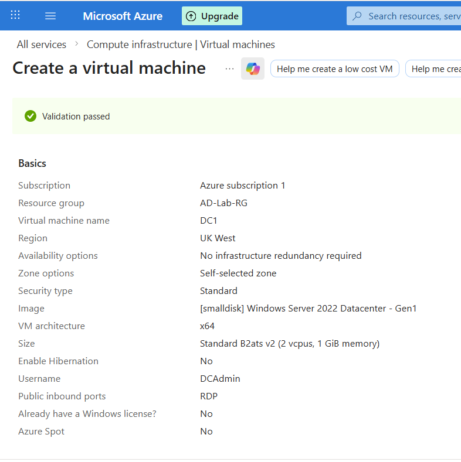

---

### 3. Active Directory Setup

Installed Active Directory Domain Services and promoted the server.

- Created domain: ADLab.local
- DNS installed automatically

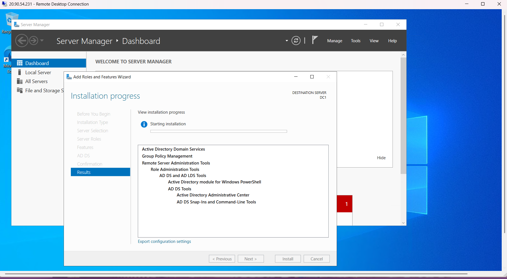

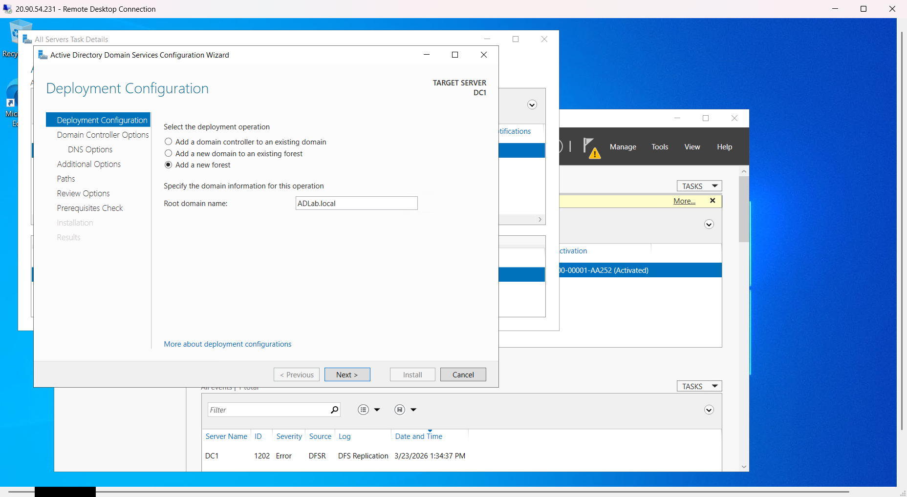

---

### 4. Client Domain Join

Created client VM and joined it to the domain.

- VM Name: Client1
- Connected to same network
- DNS pointed to Domain Controller

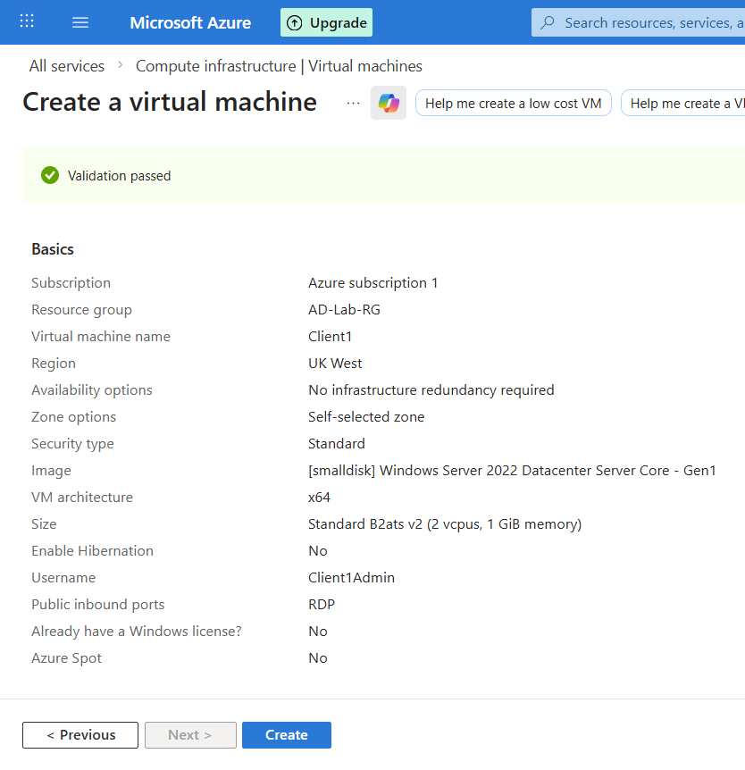

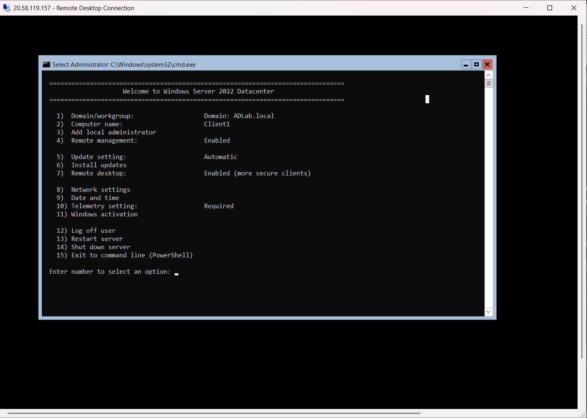

---

### 5. User and Group Management

Created users and groups in Active Directory.

Users:
- Giovanni Lee
- Jenny B
- Jhon Doe

Groups:
- HR
- IT


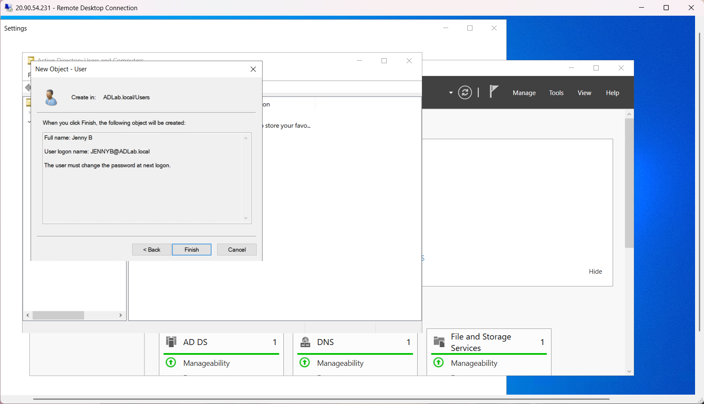

---

## 6. File Sharing

Created and configured a shared folder on the Domain Controller to simulate a company network resource.

Shared folder:

```
\\DC1\SHARED_Folder
```

Configured:
- Share permissions
- NTFS permissions
- Access testing from a domain user account

The shared folder was successfully accessed using the domain user account Giovanni Lee.

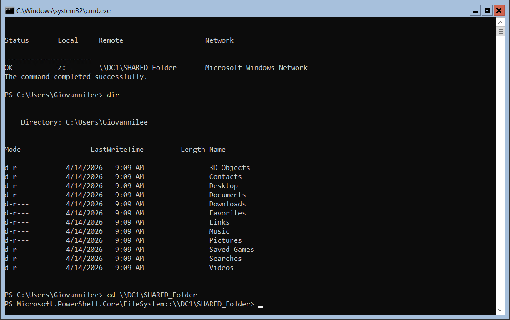

---

## 7. Group Policy Drive Mapping

To simulate a real business environment, I created a Group Policy Object (GPO) to automatically map the shared folder as a network drive for domain users.

### Creating the Group Policy Object

Created a new GPO called:

```
Drive Mapping Policy
```

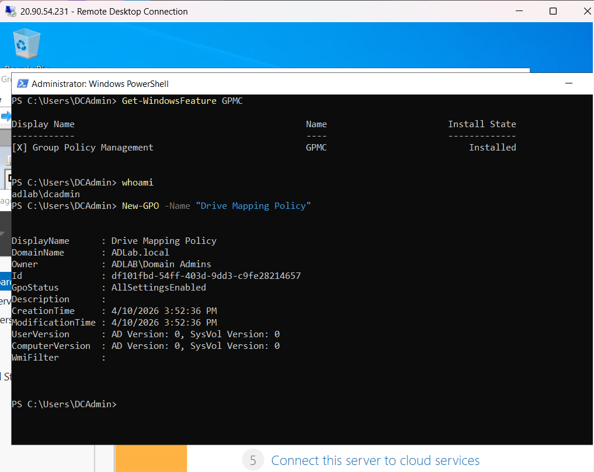

---

### Linking the GPO

The GPO was linked to the ADLab.local domain so that it could apply to domain users.

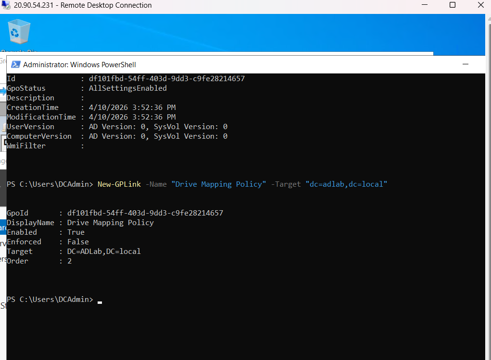

---

### Configuring Automatic Drive Mapping

Configured the GPO using Group Policy Management Editor.

The policy automatically maps:

```
Drive Letter: Z:
Location: \\DC1\SHARED_Folder
```

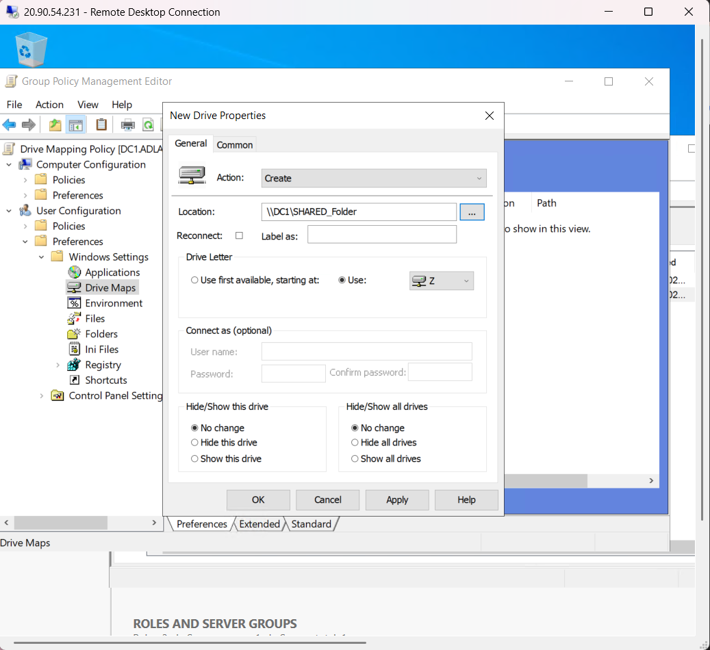

---

### Verifying Group Policy Application

Logged into Client1 using the domain user account:

```
ADLab\giovannilee
```

Verified the applied network drive using:

```powershell
net use
```

The mapped drive was successfully assigned:

```
Z: \\DC1\SHARED_Folder
```

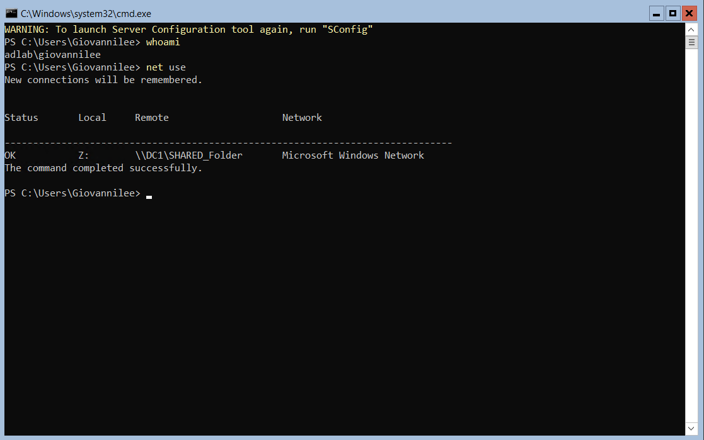

---

## 8. Testing and Troubleshooting

During the lab, I encountered and resolved several issues while configuring the domain environment.

### Authentication Troubleshooting

Initial login issues were caused by confusion between local and domain user accounts.

Troubleshooting steps:
- Verified domain membership
- Checked user credentials
- Confirmed the correct login format:

```
ADLab\giovannilee
```

---

### Group Policy Troubleshooting

The drive mapping policy did not apply immediately after configuration.

The issue was resolved by forcing a Group Policy update:

```powershell
gpupdate /force
```

After updating the policy, the mapped drive appeared successfully for the domain user.

---

## Skills Demonstrated

- Azure VM deployment
- Windows Server administration
- Active Directory management
- DNS configuration
- User and group management
- Domain joining
- Group Policy configuration
- File sharing and permissions
- Network drive mapping
- Windows troubleshooting

---

## Outcome

Successfully deployed and configured a functional Active Directory environment simulating a small business IT infrastructure.

This project demonstrates hands-on experience with:
- Identity and access management
- Windows Server administration
- User support workflows
- Troubleshooting domain environments

These skills are directly applicable to entry-level IT support and system administration roles.
